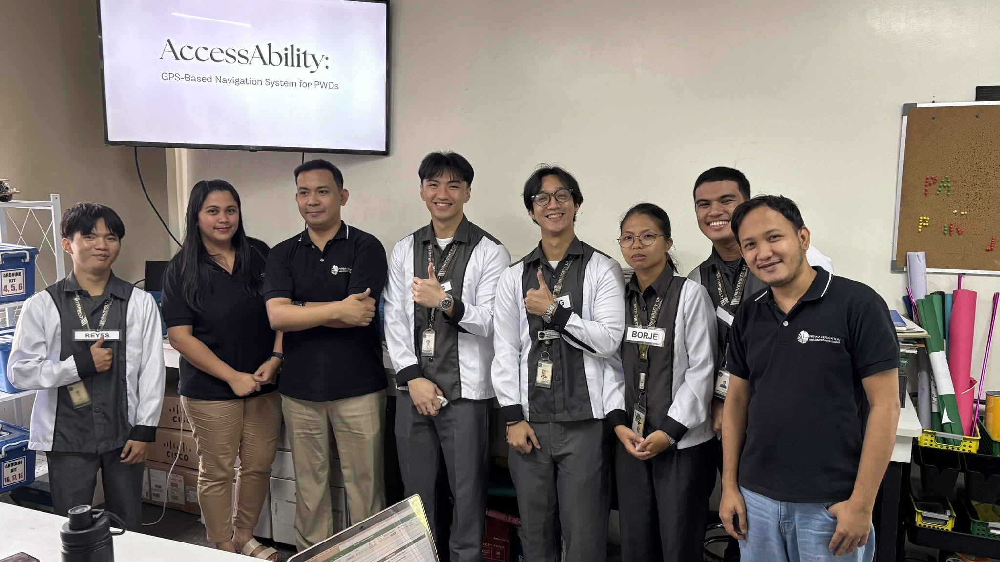

# 🚀 3Y2AAPWD – AccessAbility  
### 📍 GPS-Based Navigation System for Persons With Disabilities (PWDs)

> A Flutter-based mobile application designed to enhance mobility, independence, and accessibility for Persons With Disabilities (PWDs) in Dagupan City.

---

## 👨‍💻 Development Team – Avengers

- 👨‍💼 **Ang, Jaydeebryann E. – Project Manager**
- 🔧 **Flores, Lance Kian F. – Fullstack Developer**  
- 🔧 **Centino, Jem Harold S. – Frontend Developer and UI/UX Designer**  
- 🔧 **Reyes, Christer Dale M. – Backend Developer**
- 🎨 **Borje, Janylle A. – UI/UX Designer**  



---

## 📱 About the Project

**AccessAbility** is a GPS-based mobile application developed to assist Persons with Disabilities (PWDs) in navigating Dagupan City more efficiently and safely.

The app provides:

- 📍 Real-time GPS tracking  
- 🚨 Proximity alerts  
- 🏢 PWD-friendly establishment locator  
- 🧭 Accessible route guidance  
- 📢 Emergency and accessibility support features  

Our goal is to improve mobility, promote inclusivity, and empower PWDs to navigate their community independently.

---

## 🎯 Problem Statement

PWDs in Dagupan City face mobility challenges due to:

- Inaccessible infrastructure  
- Lack of reliable navigation tools  
- Limited information about PWD-friendly establishments  
- Difficulty accessing essential services  

AccessAbility addresses these issues using a GPS-based system that enhances:

- Real-time navigation  
- Emergency response  
- Accessibility awareness  
- Overall independence  

---

## 🎯 Objectives of the Study

- ✅ Design and develop a GPS-based mobile application for PWD mobility  
- ✅ Implement real-time tracking and accessibility alerts  
- ✅ Improve safety, independence, and convenience for PWD users  
- ✅ Promote a more inclusive and accessible city environment  

---

## 👥 Target Users

- 🧑‍🦽 Persons With Disabilities (PWDs)  
- 👨‍👩‍👧‍👦 Family Members & Caregivers  
- 🌍 General Public & Advocates  

---

## 🛠 Built With

- 💙 Flutter 3.27.1  
- 📱 Android Emulator / Physical Device  
- 🧑‍💻 VS Code / Android Studio  
- 🔧 Git  

---

## 🛠 Prerequisites

Make sure you have the following installed:

- Flutter SDK **3.27.1**
- Git
- Android Studio (for emulator & tools)
- VS Code (recommended)

---

## ⚙️ Getting Started

Follow these steps to set up and run the project:

### 1️⃣ Check Flutter Installation

Run:

```bash
flutter doctor
```
- ✔ Warnings are acceptable
- ❌ Fix any errors (except Chrome if not needed)

## 2️⃣ Ensure You're Using Flutter 3.27.1

Check your Flutter version:

```bash
flutter --version
```
If it is not **3.27.1**, switch versions:

```bash
cd /path/to/your/flutter
git checkout 3.27.1
```
## 3️⃣ Clone and Run the Project

Make sure your emulator is running or your device is connected.

```bash
git clone https://github.com/Arthritisboy/3Y2AAPWD.git
cd frontend
flutter pub get
flutter run
```
---
## 🧪 Development Methodology

This project follows the **Agile Development Methodology**, allowing iterative improvements, testing, and feedback integration throughout development.

---

## 📌 Scope and Limitations

### 📍 Scope

- Focused on improving accessibility for PWDs in Dagupan City  
- GPS-based navigation system  
- Accessibility and emergency support features  

### ⚠ Limitations

- Limited to Dagupan City  
- Requires stable mobile network and GPS services  
- May not reflect accessibility conditions outside the defined area  

---


## 💡 Significance of the Study

**AccessAbility:**

- Enhances mobility and independence for PWDs  
- Provides real-time navigation and emergency support  
- Raises awareness of accessibility challenges  
- Promotes a more inclusive and accessible society  

---

## 🙏 Acknowledgment

Thank you for supporting **AccessAbility** – empowering mobility through technology.

---

## License 📝

This project is licensed under the MIT License. See the [LICENSE](LICENSE) file for details.
